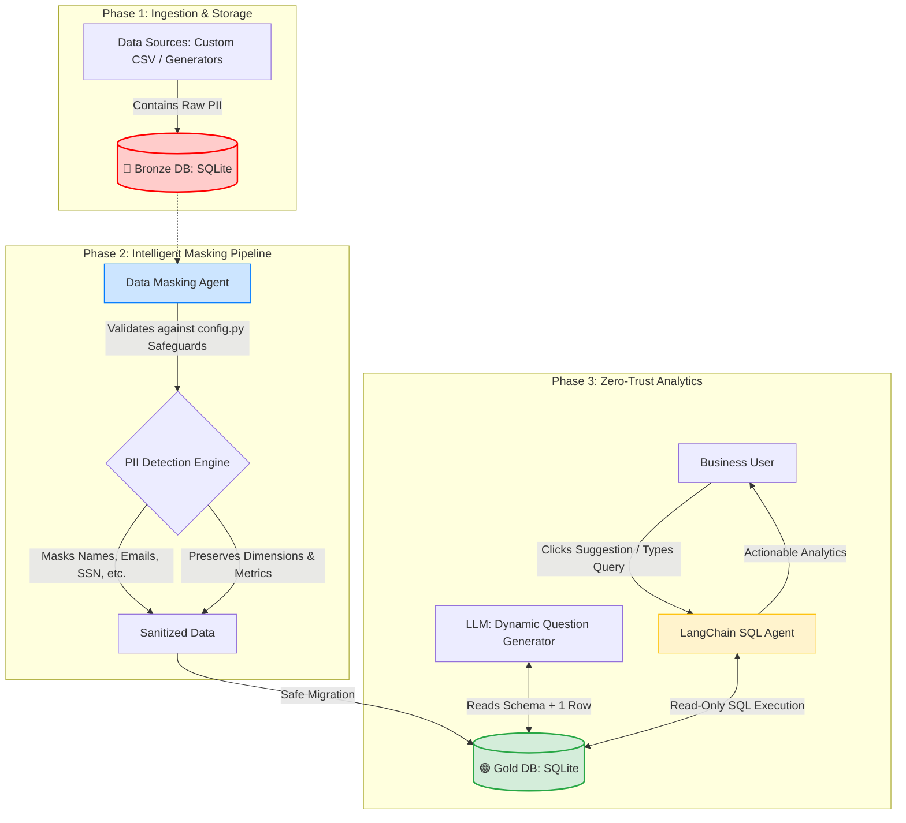

# 🛡️ SecureData Agentic Zero-Trust Pipeline


An intelligent, agentic data pipeline that ingests raw, sensitive enterprise data, safely detects and masks PII using intelligent rule-based safeguards, and empowers business users to perform natural language "Text-to-SQL" analytics via a Zero-Trust Agent architecture.

*(Add a screenshot of your app here by placing the image in your assets folder)*
<!--  -->

---

## 🌟 Key Features

- **Intelligent PII Masking with Safeguards**: Automatically detects and masks sensitive columns (Names, SSNs, Emails, etc.) while strictly preserving analytical dimensions (e.g., `AccountType`, `Department`) and numerical metrics using intelligent data-type and keyword safeguards.
- **Dynamic Data-Aware Questions**: Leverages an LLM (`openai/gpt-oss-20b`) to analyze the database schema alongside a sample data row to automatically generate context-aware, highly relevant analytical questions (groupings, aggregations) for *any* uploaded dataset.
- **Agentic Business Intelligence**: Ask complex analytical questions in natural language and receive immediate insights, markdown tables, and aggregations.
- **Zero-Trust Architecture**: The LangChain Text-to-SQL agent reads exclusively from a completely sanitized Medallion "Gold" database. The LLM never has access to the raw PII stored in the "Bronze" layer.
- **Custom Data Uploads**: Supports out-of-the-box simulated databases (Healthcare, Banking, E-Commerce) as well as custom `.csv` and `.xlsx` enterprise data uploads.

---

## 🏗️ System Architecture

The pipeline implements a simulated **Medallion Architecture** coupled with the **Principle of Least Privilege**.



---

## 🛠️ Technology Stack

| Layer | Technology Used | Purpose |
| :--- | :--- | :--- |
| **Frontend/UI** | Streamlit | Chat UI, Data Visualization, Pipeline Execution |
| **LLM Provider** | Groq API | Blazing-fast LLM inference (`openai/gpt-oss-20b`) |
| **Agentic Framework** | LangChain | `create_sql_agent` and `SQLDatabase` Tooling |
| **Data Engineering** | Pandas, SQLAlchemy | Batch processing, intelligent masking rules |
| **Database** | SQLite | Serverless, local storage simulating Bronze/Gold layers |
| **Configuration** | Python `.env` & `config.py`| Centralized PII maps, model configs, and safeguard rules |

---

## 📂 Project Structure

```text
safedata-analytics-engine/
│
├── src/
│   ├── masking_agent.py      # Logic for data-type checking, safeguards, and PII masking
│   └── sql_agent.py          # LangChain Text-to-SQL agent securely connected to Gold DB
│
├── assets/                   # Architecture diagrams and UI screenshots
│   └── demo_screenshot.png
│
├── app.py                    # Main Streamlit Frontend Application
├── config.py                 # Central configuration for LLMs, PII mapping, and safeguards
├── generate_datasets.py      # Standalone script to simulate enterprise datasets
├── requirements.txt          # Python dependencies
├── .gitignore                # Git ignore file for local DBs and secrets
└── README.md                 # Project Documentation
```

---

## ⚙️ How to Run Locally

### 1. Prerequisites
* Python 3.9+
* A free [Groq API Key](https://console.groq.com/)

### 2. Setup Virtual Environment
Clone the repository and set up your environment:
```bash
git clone <your-repo-url>
cd safedata-analytics-engine

# Create and activate virtual environment
python -m venv venv
source venv/Scripts/activate  # Windows (Git Bash)
# source venv/bin/activate    # Mac/Linux

# Install dependencies
pip install -r requirements.txt
```

### 3. Configure Environment Variables
Create a `.env` file in the root directory and add your Groq API key:
```env
GROQ_API_KEY=your_actual_groq_api_key_here
```

### 4. Launch Application
Launch the Streamlit application. The app will automatically initialize the offline datasets on first boot.
```bash
streamlit run app.py
```

---

## 🚀 Deployment Instructions (Streamlit Community Cloud)

This app is optimized for seamless deployment on Streamlit Community Cloud with auto-recovery for ephemeral storage resets.

1. Push this code to a public or private GitHub Repository.
2. Go to [Streamlit Community Cloud](https://share.streamlit.io/) and click **New app**.
3. Select your repository, branch, and set the **Main file path** to `app.py`.
4. Click **Advanced settings**, and in the **Secrets** box, add your default API key:
   ```toml
   GROQ_API_KEY = "gsk_your_api_key_here"
   ```
5. Click **Deploy**. The app will automatically spin up, generate the simulated datasets in the background, and be ready to use!

---

## 💡 Example Queries to Try

Once the Gold layer is generated, the UI will automatically generate schema-aware suggested questions for you. You can click them or type queries like:

* **Banking:** *"What is the total account balance broken down by account type?"*
* **Healthcare:** *"Which department generated the highest total bill amount?"*
* **E-Commerce:** *"What is the average order amount for the Electronics category?"*
